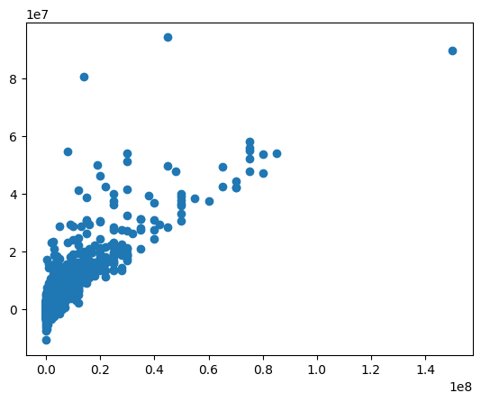

# Predicting Football Player Transfer Fees: Using A Data-Driven Approach

## Deployment
[Streamlit](https://reyadgh-7.streamlit.app/)

[FastAPI](https://use-case-7-0dl2.onrender.com/)

## Overview

This dataset is undertaken to create a predictive model for the transfer values of football players. We will utilize data from football players and construct a model to predict transfer fees based on that data. Player data includes basic information such as age, height, playing position, as well as professional statistics like goal scoring, assists (in 2 season 2021-2022 and 2022-2023), injuries, along with total individual and team awards in their career.

## About the Dataset

**Source**: Kaggle scraped from Transfermarkt

**License**: None, scraped data

**More Information:**

- This dataset was generated by scraping data from Transfermarkt using Selenium and BeautifulSoup
- This table lists the football leagues in the dataset from various continents, including Europe, America, Africa, and Asia.
   | Continent  | Number of Leagues | Leagues                                                                                           |
   |------------|-------------------|---------------------------------------------------------------------------------------------------|
   | Europe     | 11                | Premier League (England), Championship (England), Bundesliga (Germany), La Liga (Spain), Serie A (Italy), Ligue 1 (France),       Eredivisie (Netherlands), Liga NOS (Portugal), Premier Liga (Russia), Super Lig (Turkey), Bundesliga (Austria) |
   | America    | 4                 | Brasileiro (Brazil), Major League Soccer (United States), Primera División (Argentina), Liga MX (Mexico) |
   | Africa     | 1                 | DStv Premiership (South Africa)                                                                   |
   | Asia       | 4                 | J-League (Japan), Saudi Pro League (Saudi Arabia), K-League 1 (South Korea), A-League (Australia)  |

## Data Profiling and Quality Checks

### Reliability

- **Source**: Transfermarkt
- **License**: None, scraped data

### Consistency

Nothing done here

### Timeliness

- **Data Timeliness**: June 10, 2023

### Relevance

- player column was dropped

### Uniqueness

- the data were unique

### Completeness

- the data were complete

### Check Accuracy

- many natural outliers

## Linear Regression Model

### Preprocess the Data

#### Simple EDA

- EDA was done in previous step
- handled outliers using IQR

#### Feature engineering

- one host coding

#### Feature selection

| Feature                | Correlation |
|------------------------|-------------|
| highest_value          | 0.834553    |
| minutes played         | 0.420542    |
| appearance             | 0.419656    |
| award                  | 0.300454    |
| team_Manchester City   | 0.208932    |
| team_Bayern Munich     | 0.180172    |
| team_Arsenal FC        | 0.178530    |
| team_Real Madrid       | 0.169769    |
| team_Chelsea FC        | 0.168856    |

**correlation threshold:** 0.2

**selected_features:**

- appearance
- minutes played
- award
- current_value
- highest_value
- team_Manchester City

#### Prepare train and test data

- dropped the label (current_value)

#### Buliding the Model

- created LinearRegression model

#### Train the Model

- trained the model on split 80 20

#### Interpretation of the Model

- Coefficient

   | Feature                             | Coefficient      |
   |-------------------------------------|------------------|
   | position_Defender Right-Back        | 2.750121e+19     |
   | position_Defender Left-Back         | 2.668113e+19     |
   | position_encoded                    | 2.360273e+19     |
   | position_Attack-LeftWinger          | 1.337497e+19     |
   | position_Attack-RightWinger         | 1.321169e+19     |
   | ...                                 | ...              |
   | position_midfield-AttackingMidfield | -3.677992e+18    |
   | position_midfield-DefensiveMidfield | -3.915681e+18    |
   | position_midfield-CentralMidfield   | -4.403321e+18    |
   | position_Attack Centre-Forward      | -1.263885e+19    |
   | winger                              | -4.229545e+19    |

- Intercept (y = mx + b)
   - b = 3607777.4527516193

#### Evaluating the Model

1. Mean Square Error
   - Mean Squared Error of base model: 84706657179113.47
   - Mean Squared Error for training: 16833095009792.986
   - Mean Squared Error for testing: 22335978581698.273

2. Mean Absolute Error
   - Mean Absolute  Error of base model: 4438851.66013845
   - Mean Absolute Error for training: 2090883.3739918242
   - Mean Absolute Error for testing: 2257775.089749357

3. Root Mean Absolute Error
   - Root Mean Squared  Error of base model: 2106.8582439591064
   - Root Mean Squared Error for training: 4102815.4978981186
   - Root Mean Squared Error for testing: 4726095.490116368

4. R Square
   - Root Mean Squared  Error of base model: 2106.8582439591064
   - Root Mean Squared Error for training: 4102815.4978981186
   - Root Mean Squared Error for testing: 4726095.490116368

R2 Score for training: 0.795272875068149
R2 Score for testing: 0.7362925460299365

Residual Histogram

Real values vs Predictions

---

_**Riyadh Alghamdi**_

